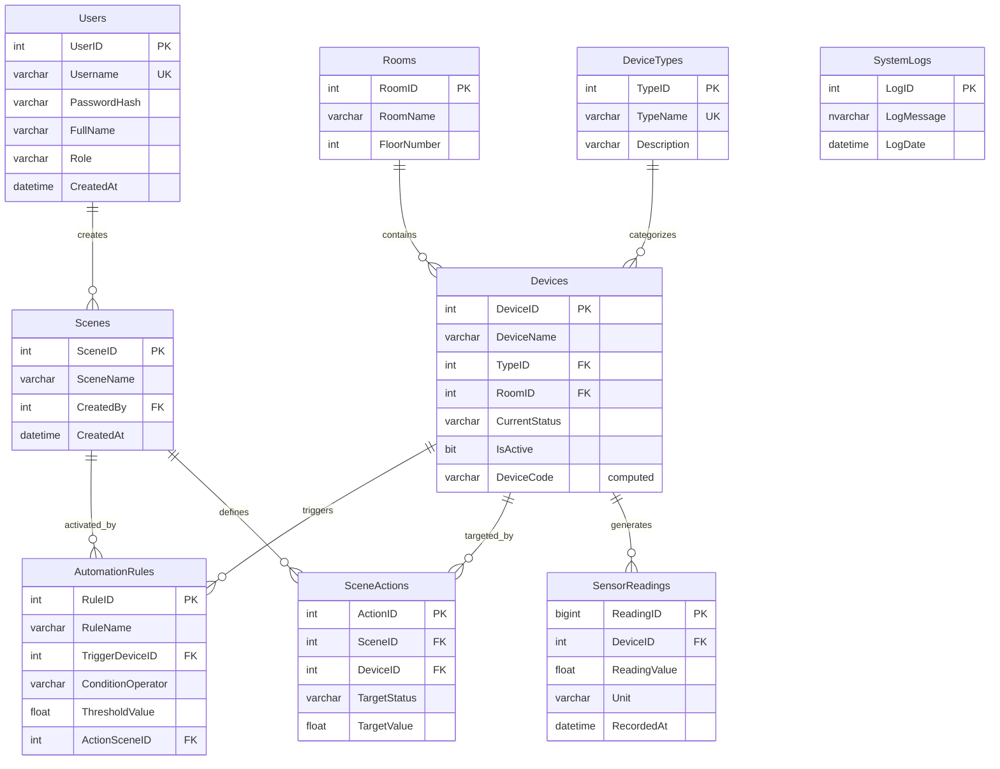

<div align="center">

# 🏠 Smart Home Database System

### Database Laboratory Project

**A comprehensive Smart Home Management Database implemented in Microsoft SQL Server**, handling device management, sensor data logging, automation scenes, and security alerts.


</div>

---

## 📑 Table of Contents

- [Executive Summary](#-executive-summary)
- [Tech Stack](#-tech-stack)
- [Entity Relationship Diagram](#-entity-relationship-diagram)
- [Project Structure](#-project-structure)
- [Database Objects](#-database-objects)
- [Key Features](#-key-features)
- [Getting Started](#-getting-started)
- [Author](#-author)

## 📌 Executive Summary

The project simulates a real-world IoT environment where devices — lights, thermostats, locks, sensors, cameras — interact via a central database. It features complex logic using **stored procedures** for actions, **triggers** for auditing and safety guards, **views and functions** for reusable logic, and **analytical queries** (CTEs, window functions) for sensor data interpretation.

## 🛠 Tech Stack

| Category | Technology |
|---|---|
| **Database Engine** | Microsoft SQL Server (T-SQL) |
| **Key Concepts** | Normalization, FK constraints, computed columns, indexing, stored procedures, triggers, CTEs, window functions |

## 🗺️ Entity Relationship Diagram



> `SystemLogs` is populated by stored procedures and triggers rather than linked with a foreign key, so it's shown above without a direct relationship line.

## 📂 Project Structure

The solution is modularized into 8 sequential scripts. **Run them in numerical order** — each script builds on the schema and data created by the ones before it.

| # | File | Description |
|---|---|---|
| 1 | `01_Base_Tables.sql` | Creates the database and core lookup tables: `Users`, `Rooms`, `DeviceTypes` |
| 2 | `02_Main_Structure.sql` | Operational tables with FK constraints: `Devices`, `SensorReadings`, `Scenes`, `SceneActions`, `AutomationRules` |
| 3 | `03_Data_Seeding.sql` | Inserts mock users, rooms, device types, devices, readings, scenes, scene actions, and automation rules for testing |
| 4 | `04_Views_And_Functions.sql` | Creates 3 views and 3 functions (see [Database Objects](#-database-objects)) |
| 5 | `05_Procedures_And_Triggers.sql` | Creates `SystemLogs`, 3 stored procedures, and 3 triggers for automation, auditing, and safety guards |
| 6 | `06_Testing_And_Verification.sql` | Executes procedures and simulates events to validate system integrity |
| 7 | `07_Phase3_Refinement.sql` | Adds a computed `DeviceCode` column, two indexes, and a loop that bulk-generates 100 sample sensor readings |
| 8 | `08_Advanced_Analytics.sql` | Analytical queries using CTEs, window functions, `EXISTS` subqueries, and `GROUP BY`/`HAVING` |

## 🧩 Database Objects

### Views
| View | Purpose |
|---|---|
| `View_FullDeviceDetails` | Joins devices with their room and type for a full, human-readable device listing |
| `View_CriticalSensors` | Surfaces readings that exceed 28°C or indicate detected motion |
| `View_RoomSummary` | Per-room device counts, including how many are currently active |

### Functions
| Function | Type | Purpose |
|---|---|---|
| `Fn_GetRoomAverageTemp` | Scalar | Returns the average Celsius reading for all devices in a given room |
| `Fn_GetDevicesByType` | Table-valued | Returns all devices matching a given device type name |
| `Fn_IsDeviceActive` | Scalar | Returns a bit flag indicating whether a device's current status counts as "active" |

### Stored Procedures
| Procedure | Purpose |
|---|---|
| `SP_ActivateScene` | Applies every action tied to a scene (e.g., turning devices on/off) and logs the activation |
| `SP_RegisterNewDevice` | Validates the device type and inserts a new device, defaulting its status to `OFF` |
| `SP_RecordSensorReading` | Inserts a new sensor reading and prints a warning if a Celsius reading exceeds 30° |

### Triggers
| Trigger | Event | Purpose |
|---|---|---|
| `TRG_AuditDeviceStatus` | `AFTER UPDATE` on `Devices` | Logs every device status change (old → new) to `SystemLogs` |
| `TRG_PreventCriticalDelete` | `INSTEAD OF DELETE` on `Devices` | Blocks deletion of devices that are `LOCKED`, `ON`, or `RECORDING` |
| `TRG_AutoSecurityAlert` | `AFTER INSERT` on `SensorReadings` | Logs a security alert whenever a motion sensor reports `1` (motion detected) |

## 🚀 Key Features

### 🎬 Scene Automation
Grouped device actions triggered as a single unit — e.g., the **"Good Night"** scene turns off the living room and bedroom lights and locks the front door in one call to `SP_ActivateScene`.

### 🔐 Security Auditing & Safeguards
- `TRG_AuditDeviceStatus` keeps a full history of device state changes.
- `TRG_AutoSecurityAlert` raises a logged alert the moment motion is detected.
- `TRG_PreventCriticalDelete` stops anyone from deleting a device that's actively locked, on, or recording.

### 🤖 Automation Rules
`AutomationRules` ties a triggering device and threshold (e.g., "temperature > 28°C") to a scene that should fire in response — the schema for reactive, condition-based automation.

### 📊 Data Analytics
`08_Advanced_Analytics.sql` demonstrates:
- A **CTE** counting total sensor readings per room
- A **window function** (`ROW_NUMBER`) to pull each device's most recent reading
- An **`EXISTS` subquery** to find devices with no sensor readings at all
- **`GROUP BY` / `HAVING`** to find devices whose average temperature exceeds 25°C

### ⚡ Performance & Data Generation
`07_Phase3_Refinement.sql` adds a computed `DeviceCode` column (derived from device name, room, and ID), indexes on `SensorReadings.DeviceID` and `Devices.RoomID`, and a loop that generates 100 realistic sensor readings across devices for analytics testing.

## ▶️ Getting Started

### Prerequisites
- Microsoft SQL Server (e.g., Express or Developer Edition)
- SQL Server Management Studio (SSMS)

### Installation

1. Clone the repository:
   ```bash
   git clone https://github.com/YasinSaberi/SmartHome-Database-System.git
   ```
2. Open SSMS and connect to your SQL Server instance.
3. Execute the scripts **in numerical order** (`01` → `08`) as listed in the [Project Structure](#-project-structure) table above, since later scripts depend on tables, data, and objects created earlier.
4. Run `06_Testing_And_Verification.sql` to confirm the system is working — it registers a device, activates the "Good Night" scene, and verifies that deleting a locked device is blocked.
5. Explore `08_Advanced_Analytics.sql` for the analytical queries over sensor data.

## 👤 Author

**Yasin** — Computer Engineering Student

---

<div align="center">

If you find this project useful, consider giving it a ⭐!

</div>
